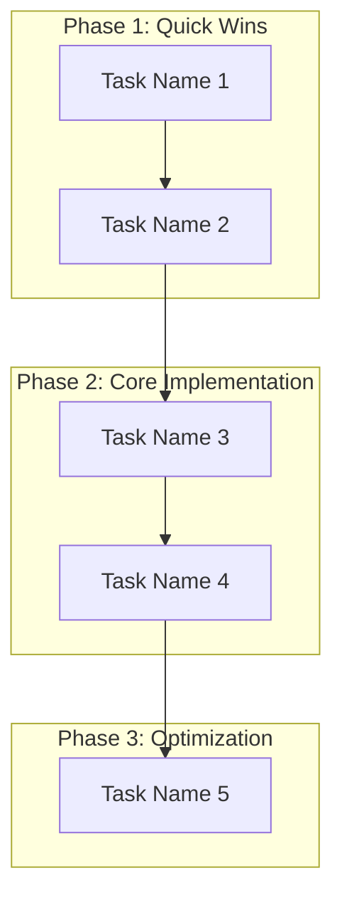

## Task Management Workflow

### NOTE 1: You always use "sequential-thinking mcp" to planning task
### NOTE 2: For every task, if i ask you "Tell me what should i do ?" or something like wanting you to plan for doing something (like: "plan for me" or "lên kế hoạch/plan cho tôi"). You ALWAYS need to create Task.md first before doing anything after.

### Task.md Template

```markdown
# Project: [Project Name]

## Current State
- **Phase**: [Current Phase]
- **Progress**: [X/Y tasks completed]
- **Next Goal**: [What we're working toward]

## Completed Tasks
- [x] Task 1 (completed date/time)
- [x] Task 2 (completed date/time)

## Pending Tasks
### Phase 1: Quick Wins (HIGH PRIORITY)
- [ ] Task Name (X minutes)
  - **Objective**: [Brief description of what to achieve]
  - **Why?**: [Purpose and impact]
  - **Files to modify**: [Specific file paths]
  - **Dependencies**: [Prerequisites]
  - **Inputs & Outputs**: [Data inputs and expected outputs]
  - **Acceptance Criteria**: [Conditions that must be met for completion]
  - **Definition of Done**: [Explicit checklist for done]
  - **Test Cases**: [How to verify correctness]

### Phase 2: Core Implementation (HIGH PRIORITY)
- [ ] Task Name (X minutes)
  - **Objective**: [Brief description]
  - **Why?**: [Purpose and impact]
  - **Files to modify**: [Specific file paths]
  - **Dependencies**: [Prerequisites]
  - **Inputs & Outputs**: [Data inputs and expected outputs]
  - **Acceptance Criteria**: [Conditions that must be met for completion]
  - **Definition of Done**: [Explicit checklist for done]
  - **Test Cases**: [How to verify correctness]

### Phase 3: Optimization (MEDIUM PRIORITY)
- [ ] Task Name (X minutes)
  - **Objective**: [Brief description]
  - **Why?**: [Purpose and impact]
  - **Files to modify**: [Specific file paths]
  - **Dependencies**: [Prerequisites]
  - **Inputs & Outputs**: [Data inputs and expected outputs]
  - **Acceptance Criteria**: [Conditions that must be met for completion]
  - **Definition of Done**: [Explicit checklist for done]
  - **Test Cases**: [How to verify correctness]

### Phase 4: Advanced Features (LOW PRIORITY)
- [ ] Task Name (X minutes)
  - **Objective**: [Brief description]
  - **Why?**: [Purpose and impact]
  - **Files to modify**: [Specific file paths]
  - **Dependencies**: [Prerequisites]
  - **Inputs & Outputs**: [Data inputs and expected outputs]
  - **Acceptance Criteria**: [Conditions that must be met for completion]
  - **Definition of Done**: [Explicit checklist for done]
  - **Test Cases**: [How to verify correctness]

## Workflow Visualization

```
# Planning Guide for LLMs

## Core Philosophy: Systematic Planning Approach

When a user asks for planning help or says "I don't know what to do next", follow this systematic approach:

### Phase 1: Understand Current State
1. **Activate Project Context**
   - Use `mcp_serena_activate_project` to load project context
   - Read existing memories: `project-overview`, `roadmap`, `technical-decisions`

2. **Analyze Codebase Structure**
   - Use `get_symbols_overview()` to understand current architecture
   - Use `find_symbol()` to locate relevant components
   - Use `search_for_pattern()` to identify incomplete implementations

3. **Identify Gaps & Issues**
   - Look for `pass` statements in critical methods
   - Check for commented-out configurations
   - Find missing implementations or broken dependencies

### Phase 2: Systematic Problem Analysis
1. **Use Sequential Thinking**
   - Break down complex problems into logical steps
   - Identify dependencies between tasks
   - Prioritize based on impact and effort

2. **Research Best Practices**
   - Use `mcp_brave-search_brave_web_search` for external research
   - Use `mcp_context7_*` for library-specific documentation
   - Combine with codebase analysis for context-aware solutions

### Phase 3: Create Actionable Plan
1. **Structure the Plan**
   - Break into phases with clear priorities
   - Estimate effort for each task
   - Identify potential risks and dependencies

2. **Provide Multiple Options**
   - Give user choice between different approaches
   - Explain pros/cons of each option
   - Suggest starting points based on user's experience level

## Standard Planning Workflow

### Step 1: Context Loading
```python
# Always start with project context
mcp_serena_activate_project(project_name)
mcp_serena_read_memory("project-overview")
mcp_serena_read_memory("roadmap")
```

### Step 2: Current State Analysis
```python
# Understand what exists
mcp_serena_get_symbols_overview(target_directory)
mcp_serena_find_symbol("CriticalComponent")
mcp_serena_search_for_pattern("def parse.*pass")
```

### Step 3: Problem Decomposition
```python
# Use systematic thinking for complex problems
mcp_sequential-thinking_sequentialthinking(
    thought="Break down the user's request into logical steps",
    # ... systematic analysis
)
```

### Step 4: Research & Validation
```python
# Get external knowledge if needed
mcp_brave-search_brave_web_search("best practices for [specific task]")
mcp_context7_get_library_docs("library_name", "relevant_topic")
```

### Step 5: Plan Creation
```python
# Create structured plan with priorities
# Phase 1: Quick wins (HIGH PRIORITY)
# Phase 2: Core implementation (HIGH PRIORITY)  
# Phase 3: Optimization (MEDIUM PRIORITY)
# Phase 4: Advanced features (LOW PRIORITY)
```

### Step 6: Review & Confirm Plan
- **Action**: Explicitly ask the user for confirmation.
- **Example Prompt**: "Here is the proposed plan. Does this look good to you? Are there any adjustments you'd like to make before we proceed?"
- **Goal**: Ensure alignment before creating tasks.

## Planning Patterns for Common Scenarios

### Scenario 1: "I don't know what to do next"
1. **Analyze current state** → Find incomplete implementations
2. **Identify quick wins** → Tasks that can be completed quickly
3. **Prioritize by impact** → What will move the project forward most
4. **Provide clear next steps** → Specific, actionable tasks

### Scenario 2: "Help me plan this feature"
1. **Understand requirements** → What does the user want to achieve?
2. **Analyze existing patterns** → How is similar functionality implemented?
3. **Research best practices** → What are the recommended approaches?
4. **Create implementation plan** → Step-by-step with dependencies

### Scenario 3: "Debug this issue"
1. **Reproduce the problem** → Understand what's broken
2. **Analyze error context** → Find related code and dependencies
3. **Research solutions** → Look for similar issues and fixes
4. **Plan fix strategy** → Systematic approach to resolution

### Scenario 4: "Refactor this code"
1. **Analyze current structure** → Understand what exists
2. **Identify improvement areas** → Find code smells and issues
3. **Research refactoring patterns** → Best practices for the specific case
4. **Plan incremental changes** → Safe, step-by-step refactoring

### Scenario 5: "I'm facing a completely new problem"
1. **Deconstruct & Research (The "What")**:
   - Use web search to find high-level tutorials and core concepts for the new domain.
   - Break the problem down into fundamental principles.
2. **Explain the Rationale (The "Why")**:
   - Clearly articulate *why* a specific technology or approach is the right tool for this job.
   - Explain the benefits and trade-offs compared to alternatives.
3. **Provide a Learning Path (The "How")**:
   - Propose a simple "first step" or a "Hello, World!" equivalent to build initial confidence.
   - Structure the plan as a learning journey, from basic setup to a simple, working implementation.
   - Provide links to key documentation and code examples.

## Planning Output Format

### Standard Response Structure
```
## Understanding (Current State)
- What I found in the codebase
- Key components and their status
- Identified gaps and issues

## Insights (Analysis)
- What this means for the project
- Dependencies and relationships
- Potential risks or considerations

## Risks & Mitigation
- **Risk 1**: [Potential issue]
  - **Mitigation**: [How to prevent or handle it]
- **Risk 2**: [Potential issue]
  - **Mitigation**: [How to prevent or handle it]

## Plan (Actionable Steps)
### Phase 1: Quick Wins (HIGH PRIORITY)
- [ ] Task 1 (5 minutes)
- [ ] Task 2 (10 minutes)

### Phase 2: Core Implementation (HIGH PRIORITY)  
- [ ] Task 3 (30 minutes)
- [ ] Task 4 (1 hour)

### Phase 3: Optimization (MEDIUM PRIORITY)
- [ ] Task 5 (2 hours)

## Next Steps
- Specific actions to take immediately
- Tools to use for each step
- Success criteria for completion
```

## Planning Best Practices

### Do's
- Always start with project context
- Break complex problems into smaller steps
- Provide multiple options when appropriate
- Estimate effort and prioritize tasks
- Consider dependencies between tasks
- Update memory with decisions and progress

### Don'ts
- Don't assume user knows the codebase
- Don't skip context loading
- Don't give vague, high-level advice
- Don't ignore existing patterns in the codebase
- Don't forget to consider user's experience level

### Communication Guidelines
- **Be specific**: Give exact commands and file paths
- **Be actionable**: Every step should be doable immediately
- **Be educational**: Explain why each step matters
- **Be flexible**: Provide options when appropriate
- **Be thorough**: Consider edge cases and potential issues

## Success Criteria for Planning

A good plan should:
1. **Be immediately actionable** → User can start right away
2. **Have clear priorities** → Know what to do first
3. **Include effort estimates** → Realistic time expectations
4. **Consider dependencies** → Logical order of tasks
5. **Provide alternatives** → Options for different approaches
6. **Update context** → Save decisions for future reference

## Task Management Workflow

### Task Creation (After Planning)
When LLM creates a plan, ALWAYS create a `task.md` file with:

1. **Project Overview**: Current state and goals
2. **Current Phase**: What phase we're in
3. **Completed Tasks**: What's already done
4. **Pending Tasks**: What needs to be done with effort estimates
5. **Next Actions**: Immediate next steps
6. **Success Criteria**: How to know when done

### Task Rationale Guidelines
For each task in task.md, ALWAYS include:

1. **Why this task?** (Purpose and impact)
   - What problem does it solve?
   - What dependencies does it enable?
   - What's the immediate benefit?

2. **Files to modify** (Specific file paths)
   - Which files need to be changed?
   - What changes are needed?
   - Any new files to create?

3. **Dependencies** (What needs to be done first)
   - Prerequisites
   - Related tasks
   - Potential conflicts

### Task Update Workflow
When user says "cập nhật task":

1. **Read current task.md** to understand current state
2. **Update completed tasks** based on user's progress
3. **Update pending tasks** with new priorities if needed
4. **Initiate Feedback Loop**: Ask "What did we learn from this task? What could be improved next time?"
5. **Update memory** (roadmap, technical-decisions, context-learnings)
6. **Write updated task.md** with current progress
7. **Provide next immediate actions**

### Task Breakdown Workflow
When user says "breakdown task + task_name":

1. **Identify the specific task** from task.md
2. **Analyze task complexity** and requirements
3. **Create task-breakdown.md** with detailed breakdown
4. **Provide step-by-step instructions**
5. **Include testing and validation steps**

## Continuous Improvement

### Feedback Loop
- After each significant task, a feedback loop is initiated.
- The goal is to capture learnings, identify bottlenecks, and refine future processes.
- Learnings are stored in the `context-learnings` or `technical-decisions` memory.

### Regular Review
- Periodically, we should review the `roadmap` and `technical-decisions` to ensure they are still aligned with the project goals.
- This helps in adapting to new requirements and insights.

### Task.md Template
```markdown
# Project: [Project Name]

## Current State
- **Phase**: [Current Phase]
- **Progress**: [X/Y tasks completed]
- **Next Goal**: [What we're working toward]

## Completed Tasks
- [x] Task 1 (completed date/time)
- [x] Task 2 (completed date/time)

## Pending Tasks
### Phase 1: Quick Wins (HIGH PRIORITY)
- [ ] Task 3 (5 minutes)
  - **Why?**: [Purpose and impact]
  - **Files to modify**: [Specific files]
  - **Dependencies**: [Prerequisites]

- [ ] Task 4 (10 minutes)
  - **Why?**: [Purpose and impact]
  - **Files to modify**: [Specific files]
  - **Dependencies**: [Prerequisites]

### Phase 2: Core Implementation (HIGH PRIORITY)
- [ ] Task 5 (30 minutes)
  - **Why?**: [Purpose and impact]
  - **Files to modify**: [Specific files]
  - **Dependencies**: [Prerequisites]

- [ ] Task 6 (1 hour)
  - **Why?**: [Purpose and impact]
  - **Files to modify**: [Specific files]
  - **Dependencies**: [Prerequisites]

## Next Actions
1. **Immediate**: [Specific action to take now]
2. **Tools needed**: [Which tools to use]
3. **Success criteria**: [How to know it's done]

## Progress Tracking
- **Total tasks**: X
- **Completed**: Y
- **Remaining**: Z
- **Estimated time**: [Time estimate]

## Success Criteria
- [ ] Criteria 1
- [ ] Criteria 2
- [ ] Criteria 3
```

### Task-breakdown.md Template
```markdown
# Task Breakdown: [Task Name]

## Task Overview
- **Objective**: [What we want to achieve]
- **Impact**: [Why this matters]
- **Effort**: [Time estimate]
- **Priority**: [HIGH/MEDIUM/LOW]

## Prerequisites
- [ ] Prerequisite 1
- [ ] Prerequisite 2
- [ ] Prerequisite 3

## Files to Modify
- **Primary files**:
  - `file1.py`: [What changes needed]
  - `file2.py`: [What changes needed]
- **New files to create**:
  - `newfile.py`: [Purpose and content]
- **Configuration files**:
  - `settings.py`: [What to add/change]

## Step-by-Step Instructions

### Step 1: [Action Name] (X minutes)
1. **Action**: [Specific action to take]
2. **File**: [Which file to modify]
3. **Code**: [Exact code to add/change]
4. **Test**: [How to verify this step]

### Step 2: [Action Name] (X minutes)
1. **Action**: [Specific action to take]
2. **File**: [Which file to modify]
3. **Code**: [Exact code to add/change]
4. **Test**: [How to verify this step]

### Step 3: [Action Name] (X minutes)
1. **Action**: [Specific action to take]
2. **File**: [Which file to modify]
3. **Code**: [Exact code to add/change]
4. **Test**: [How to verify this step]

## Testing & Validation
- **Test 1**: [How to test this functionality]
- **Test 2**: [How to verify output]
- **Test 3**: [How to check for errors]

## Success Criteria
- [ ] Criteria 1: [Specific measurable outcome]
- [ ] Criteria 2: [Specific measurable outcome]
- [ ] Criteria 3: [Specific measurable outcome]

## Potential Issues & Solutions
- **Issue 1**: [What could go wrong]
  - **Solution**: [How to fix it]
- **Issue 2**: [What could go wrong]
  - **Solution**: [How to fix it]

## Related Tasks
- **Dependencies**: [Tasks that must be done first]
- **Enables**: [Tasks that become possible after this]
- **Conflicts**: [Tasks that might conflict]

## Resources
- **Documentation**: [Links to relevant docs]
- **Examples**: [Similar implementations]
- **Tools**: [Tools needed for this task]
```